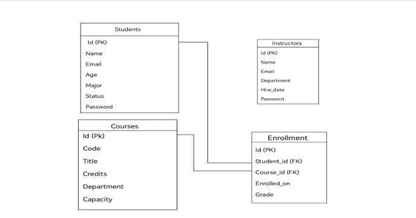
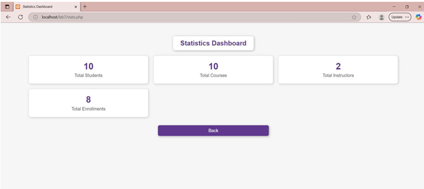
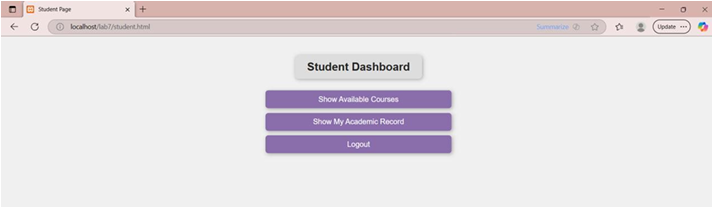

# University Course Management System

## Overview

Developed a web-based university course management system that allows students and instructors to manage courses, enrollments, and academic records.

## Technologies

- PHP
- HTML
- SQL
- MySQL
- PDO

## Features

- Student and instructor authentication
- Course enrollment system
- Academic record management
- Grade assignment
- Student profile management
- Course search functionality
- Statistics dashboard
- Database integration

## User Roles

### Student

- Login
- View available courses
- Enroll in courses
- View academic records
- View grades

### Instructor

- Login
- View courses
- View enrolled students
- Assign grades
- Monitor statistics

## Skills

- PHP
- SQL
- MySQL
- Database Design
- Authentication
- Session Management
- CRUD Operations
- Web Development

## Results

Successfully designed and implemented a university course management system with support for multiple user roles and database-driven functionality.

## Screenshots

### Entity Relationship Diagram

### Statistics Dashboard

### Student Dashboard

